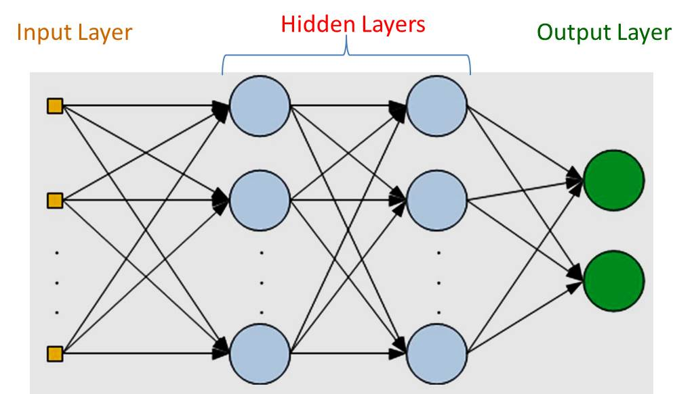
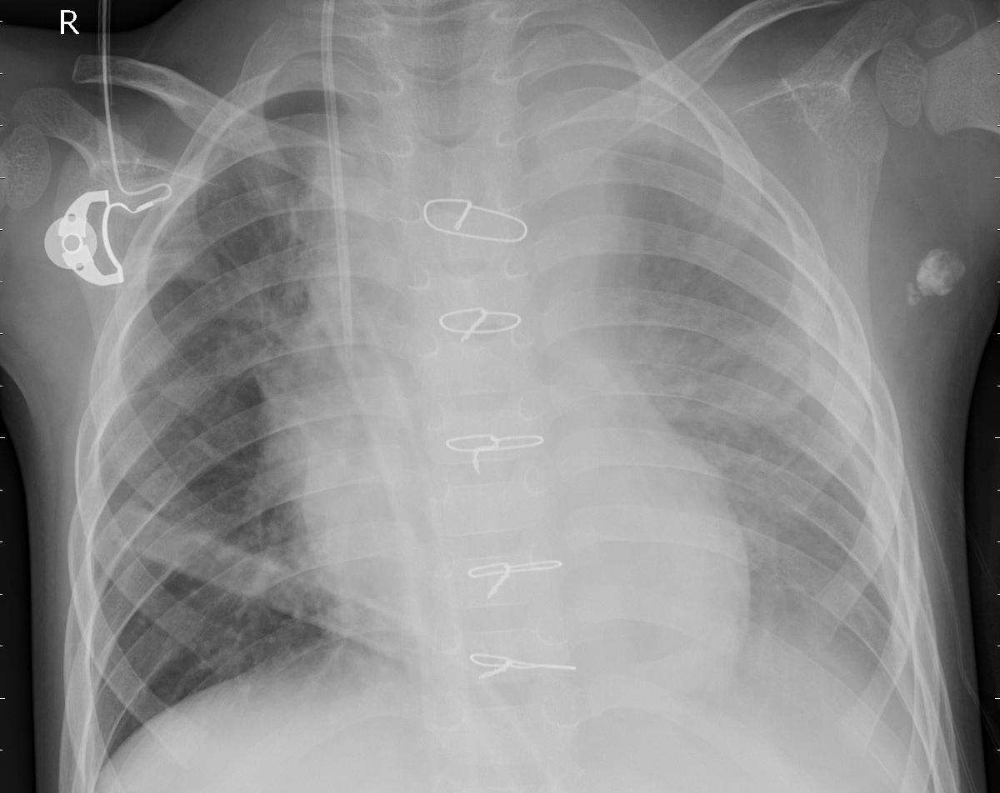

```{r setup, include=FALSE}
knitr::opts_chunk$set(echo = TRUE)
```



In this project, we will look at classifying X-Ray images for the presence of signs of Pediatric Pneumonia using a Convolutional Neural Network. The dataset, which is  linked [here](https://www.kaggle.com/paultimothymooney/chest-xray-pneumonia), contains about 5800 X-Ray Images obtained from Guangzhou Women and Children’s Medical Center, Guangzhou from patients age 1-5. All these images are classified as 'Normal' or 'Pneumonia' by a team of physicians before the dataset was released.

We will be using about 5200 of these images for training and about 600 images for testing. My 2 goals for this model were to have both an overall accuracy and a sensitivity of above 0.9.

I have presented below 2 example images for each class. 

Normal X-Ray:


Pneumonia X-Ray:


```{r message=FALSE, warning=FALSE}
library(caret) #for constructing confusion matrix
library(tidyverse) 
library(tensorflow) #modelling
library(keras) #modelling

```

The keras package is a very high level neural networks API that simplifies a lot of the model building process in building deep learning models. This is designed in python but the package creates a conda environment in RStudio where the R code is translated into Python and run. 


First we define the paths to the folders containing the relevant images. 

```{r}
train_dir  = 'chest_xray/train/'


validation_dir = 'chest_xray/val/'


test_dir       = 'chest_xray/test/'
```

Then we define some variables that we will be using in the model building process. 

Image size is a very important parameter to decide upon in the model building process. The larger your images are, the more information the network has to process, which allows it to come to more accurate conclusions. It also means that training the model takes a lot longer and you would require more and more computational power. The sweet spot for this model was around 150x150 pixels. Above this, I encountered issues with my machine crashing, and below this, the model accuracy was still lacking. 
X-Ray Images are grayscale by definition and defining them as such for the tensors increased the training time significantly. However, the final model I decided on used a base of an 'inception' model that had been trained on the Imagenet database, where the images are not grayscale but RGB, and in order to use those base layers for the network, the input images had to be RGB too.

Batch size of about 32 seems to be pretty common for models trained on a CPU. Processing the image tensors in batches does not provide a signigicant advantage in machines with just a CPU as they cannot conduct batch processing. However, the keras library was defined to be compatible with GPUs, which do conduct batch processing, so we do need to define a batch size.

The number of iterations the network goes through the entire training dataset during the model training process is said to be the number of epochs of the model. Higher epochs lead to higher training times but more accurate models until overfitting takes over. 5 epochs provided the sweet spot of enough iterations to build an accurate enough model while avoiding overfitting and also without consuming a lot of time. 

```{r}
# number of output classes 
output_n <- 2

img_width <- 150
img_height <- 150
target_size <- c(img_width, img_height)

# RGB = 3 channels
#grayscale = 1 channel
channels <- 3

batch_size <- 32

# number of training epochs
epochs <- 5
```

The images are then loaded into an object known as a data generator and their array values are divided by 255. This is because the pixel values are defined between 1 and 255 (8-bit) for each channel and we need these values to be between 0 and 1 for training our network.

Next is a step known as data augmentation. This is where we take the images and make a variety of small changes to them to create a bunch of new images. This process increases the training data that we have, it reduces the chances of overfitting and also makes the model more robust in predicting images that may not be exactly similar in their format to the images that were used in training. This can be achieved by a variety of methods such as rotating the images slightly, stretching the images verticlly or horizontally, or stretching the image in some other direction(shearing), zooming, or flipping the images.
It is important to the note that data augmentation is always only performed on the training data only. 

As for the exact parameters for these methods, I replicated values which I came across in a textbook. You could perform some trial and error with them to see if it makes a significant change but this would take up a lot of time, and I decided that there were other changes to the model that promised more certain increases in performance.

```{r}

train_data_gen <- image_data_generator(
  rescale            = 1/255    ,
  # data augmentation
  rotation_range     = 5        ,
  width_shift_range  = 0.1      ,
  height_shift_range = 0.05     ,
  shear_range        = 0.1      ,
  zoom_range         = 0.15     ,
  horizontal_flip    = TRUE     ,
  vertical_flip      = FALSE    ,
  fill_mode          = "reflect"
)

validation_test_datagen <- image_data_generator(rescale = 1/255)
```

This is the where the image tensors are created and batched together to a form that is a compatible input to the neural network.

```{r}
# training images
train_image_array_gen <- flow_images_from_directory(train_dir, 
                                          train_data_gen,
                                          subset = 'training',
                                          target_size = target_size,
                                          class_mode = "categorical",
                                          classes = c('NORMAL', 'PNEUMONIA'),
                                          color_mode = 'rgb',
                                          batch_size = batch_size,
                                          seed = 42)
```

```{r}
# validation images


valid_image_array_gen <- flow_images_from_directory(
  validation_dir                          ,
  validation_test_datagen                 ,
  classes     = c('NORMAL', 'PNEUMONIA')  ,
  target_size = target_size ,
  batch_size  = batch_size     ,
  color_mode = 'rgb',
  class_mode  = "categorical"             ,
#  shuffle     = T                         ,
  seed        = 42
)
```


```{r}
# number of training samples
train_samples <- train_image_array_gen$n

# number of validation samples
valid_samples <- valid_image_array_gen$n


```


The model I settled with uses a concept called transfer learning. This is where you use a model that has previously been trained on some other non-related datset and use it as a convolutional base for your model. This base, while having no relationship to our dataset will have the capability to identify common features in images such as edges, loops, strokes and so on. The additional layers on top of this base would then specialize on features from images on our dataset to give us our complete model.

InceptionV3 is one such pretrained model and I used the version of the model that was trained on a massive crowdsourced visual database that is commonly used in deep learning research known as ImageNet. This is a very simple implementation of this method.

The output of this base is a 3D tensor and we flatten that output into a 1D vector. We feed this 1D vector into 2 layers of densely connected neural network layers. Densely connected layers are those where all neurons in 1 layer are connected to all neurons in the other layers.

There is a lot of room in picking the number of units in a dense layer( 256 here) and it is basically a trial and error process to tune this number, which can be very time consuming. General advice was that for binary classification 1 layer of 256 units should be enough so I decided to adopt that. The final dense layer will be providing our classification output and so the number of units in this layer should match the number of classes in our classification task. 

Then we compile our model by defining the loss function, which is the function by which the network measures its performance while training. Binary cross-entropy is the go to function for binary classification tasks. It measures the distance of the classification probabilities from the 0 and 1 values, and then finds the average for this value over the entire training set.

The optimizer is the algorithm by which the network updates its weights according to the feedback from the loss function. The classic example of this is the Stochastic Gradient Descent method. While this method would work perfectly fine for this task, I opted to use the rmsprop function since it is considered to handle saddle points better when trying to find global minima in the loss function.

The metric is just the accuracy of the model in classifying the images. This is not used in training the model but to give a more intepretable measure of the model's performance that the loss value.

```{r eval= FALSE}
#inception model implementation

conv_base <- application_inception_v3(
  weights = "imagenet",
  include_top = FALSE,
  input_shape = c(img_width, img_height, channels)
)


model <- keras_model_sequential() %>%
  conv_base %>%
  layer_flatten() %>%
  layer_dense(units = 256, activation = "relu") %>%
  layer_dense(units = output_n, activation = "sigmoid") 


model %>% compile(
  loss = "binary_crossentropy",
  optimizer = optimizer_rmsprop(lr = 2e-5),
  metrics = c("accuracy")
)
```

The final architecture of the model is displayed below.

```{r}
model <- load_model_hdf5("xray_model_inc.h5")
model
```

Then we start training the model. I've stopped this code from evaluating during knitting since it took several hours for the training to complete but I've loaded in the trained model above and will evaluate that model on the training dataset to display the training results. 

```{r eval= FALSE}
hist <- model %>% fit_generator(
  # training data
  train_image_array_gen,
  
  # epochs
  steps_per_epoch = as.integer(train_samples / batch_size), 
  epochs = epochs, 
  
  
  # validation data
  validation_data = valid_image_array_gen,
  validation_steps = as.integer(valid_samples / batch_size)
)
```

```{r warning=FALSE}
model %>%
  evaluate_generator(train_image_array_gen, 
                     steps = as.integer(train_samples / batch_size))
```

We've obtained a training accuracy of 0.98 which is pretty high for a basic model such as this, which leads us to believe we may be overfitting. We can check this by evaluating our model on the test images.

```{r}
#model %>% save_model_hdf5("xray_model_inc.h5")
#model <- load_model_hdf5("xray_model_inc.h5")
```

Setting up the test images.

```{r}
test_datagen <- image_data_generator(rescale = 1/255)

test_generator <- flow_images_from_directory(
        test_dir,
        test_datagen,
        target_size = target_size,
        class_mode = "categorical",
        classes = c('NORMAL', 'PNEUMONIA'),
        color_mode = 'rgb',
        batch_size = 1,
        shuffle = FALSE,
        seed = 42)
```

```{r warning=FALSE}
model %>%
  evaluate_generator(test_generator, 
                     steps = as.integer(test_generator$n))
```

The accuracy on our test images is 0.91, which confirms our suspicions of overfitting to the training data but is still pretty good and meets the 0.9 accuracy target we had set at the begining of the project.

(The comments below are some notes I had made from previous modelling attempts.)

```{r}
# without aug,val=val 0.7152619 0.7884616 
# after aug, val=val 0.4689246 0.7836539 
# grayscale instead of rgb : loss about the same, accuracy up by 0.02
# changed activation to sigmoid from soft max 0.4181049 0.8028846 (no change)
# changed loss to binary cross_entropy        0.397662 0.823718 (up 0.02)
#changed to 5 epochs 0.3537454 0.8381410
#image size 100(instead of 20)   0.2994733 0.8814102
#image size back to 20  0.3393419 0.8509616 
#leaning rate 1e-5 0.4950307 0.8221154
# learning rate 1e-5 10 epoch 0.3916168 0.8429487
#learning rate 1e-4
# inception model (trainloss: 0.1576 - accuracy: 0.9455) test: 0.4818154 0.8814102 (overfitting)

# scr model 10 epoch, 150x150 : train: (loss: 0.1555 - accuracy: 0.9439) (test: 0.5519876 0.8381410 )
# scr model 5 epoch, size 150x150 or 20x20: test: loss: 0.3339 - accuracy: 0.8542
# scr model grayscale 5 epoch 100x100 loss: 0.2771 - accuracy: 0.8942

#scr model rgb 5 epoch 100x100 : 0.85
#scr model rgb 5 epoch 150x100: 0.84

# inception model 5 epoch 150x150 loss: 0.3986 - accuracy: 0.9103 
```


To deconstruct these test image evaluations, we can build a confusion matrix. (This was a neat bit of code I found that managed this)

```{r warning=FALSE}
preds   <- predict_generator(model,
                             test_generator,
                             steps = length(list.files(test_dir, recursive = T)))
                            
predictions                                                       <- data.frame(test_generator$filenames)
predictions$prob_pneumonia                                        <- preds[,2]
colnames(predictions)                                             <- c('Filename', 'Prob_Pneumonia')
predictions$Class_predicted                                       <- 'Normal'
predictions$Class_predicted[predictions$Prob_Pneumonia >= 0.5]    <- 'Pneumonia'
predictions$Class_actual                                          <- 'Normal'
predictions$Class_actual[grep("PNEUMONIA", predictions$Filename)] <- 'Pneumonia'
predictions$Class_predicted                                       <- as.factor(predictions$Class_predicted )
predictions$Class_actual                                          <- as.factor(predictions$Class_actual )
confusionMatrix(predictions$Class_predicted, predictions$Class_actual, positive = 'Pneumonia')
```

The most dangerous case is where the model would classify an X-Ray image as normal, while the person actually does have pneumonia. The metric that reflects that is sensitivity, the true positive rate, which is 0.98 in this model which means that only about 2% of the cases where the person had pneumonia were incorrectly classified as 'Normal'. 

Most of the errors were due to cases where the model would predict 'Pneumonia' on images that were actually 'Normal', which gave the comparatively lower Specificity of 0.79. Overall, this gave the model an accuracy of 0.91. 

This model achieved the 2 objectives of an accuracy and sensitivity of over 0.9.


